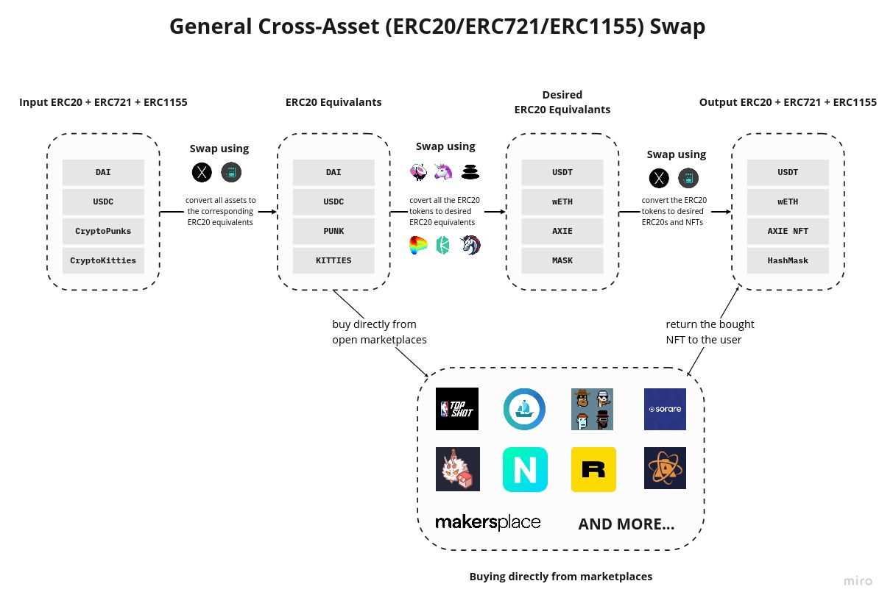

## cross-asset-swap

> A generalized 1inchProtocol-like protocol, allowing optimized swaps between any ERC-20/721/1155

## Architecture

## Supported Markets

|    SELL     |     BUY     |
| ----------- | ----------- |
| NFTX        | NFTX       |
| NFT20       | NFT20        |
|   | CryptoPunks |
|   | Rarible |
|   | AxieInfinity |
|   | Mooncats |
|   | EulerBeats |
|   | SuperRare |
|   | KnownOrigin |
|   | Makerspace (WIP) |
|   | OpenSea (WIP) |
|   | Sorare (TODO) |

<!-- |   | Foundation.app (Auction Only) | -->
<!-- ------------

Makerspace: https://etherscan.io/address/0x7e3abdE9D9E80fA2d1A02c89E0eae91b233CDE35
Link: https://makersplace.com/galamirissa/frida-kahlo-i-love-you-more-than-my-own-skin-1-of-1-53232/
method: Purchase
Parameters:
[
{
    "type": "uint256"
  },
  {
    "type": "address"
  }
]
Data: 0xae77c237000000000000000000000000000000000000000000000000000000000000be310000000000000000000000002a46f2ffd99e19a89476e2f62270e0a35bbf0756

0xae77c237000000000000000000000000000000000000000000000000000000000000c1f90000000000000000000000002a46f2ffd99e19a89476e2f62270e0a35bbf0756
-------------

0x8Cac485c30641ece09dBeB2b5245E24dE4830F27 -->